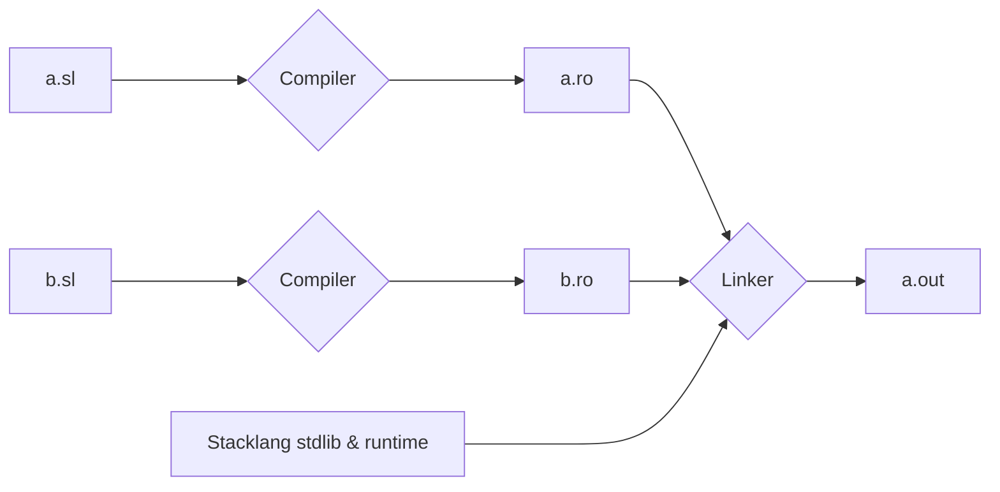
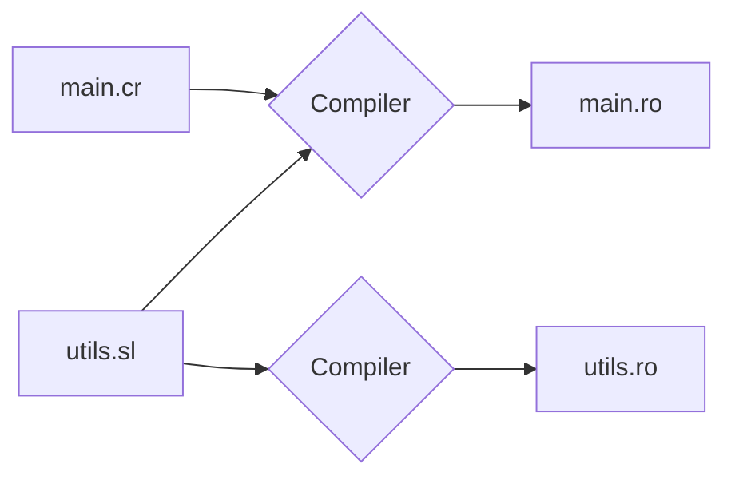

# Stacklang specifications

Stacklang is a rudimentory C-like imperative langage. 
The top level of a stacklang file can contain:
- Requirement, to bring in prototypes of external symbols
- Global variables declaration
- Structure types declarations
- Functions declarations

## Entry point

When building a program, the entry point is the `main` function. It is expected to be present by the language runtime.  

## Comments

Stacklang source can be commented by putting comment between `/*` and `*/`.  
Comments blocks can be nested.  
```sl
fun main:_ {
    a = 1 + 2
    /* 
      this is not code
      /* neither this is */
    */
    return a
}
```

## Types

Stacklang has four primitive types / category of types:
- The word type, written `_`, which represent a single 16 bits word.  
  Signedness is up to interpretation.  
  In the various place where a type constraint is required but optionnal, this is the default type.  
- Table types are used for fixed size continuous data of similar types: `[<size>]<target>` 
  - `[10]_` is a table of 10 word. The target is optional and default to `_`, so this is the same as `[10]`
  - `[0x_1_0]*_` is a table of ten pointer to word
  - `[3][2]` is a table of three table of two word
- Pointer types, written `*<target>`. Pointer are used to store addresses.  
  - The target is optionnal and default to word. This mean `*` and `*_` are both pointer to word.
  - `**` or `**_` are pointer to pointer to word
  - `*Entry` is a pointer to structure of type `Entry`. 
- Structure types, which are user defined and 
  whose name must starts with an uppercase letter and 
  can contain letters and underscores.

## Defining Functions

Functions definitions starts with the `fun` keyword, followed by the name, parameters and an optionnal return type restriction.  
When declaring a prototype for a function implemented in a scope that cannot be reached during this compiler run, the `fun` keyword can be followed by `extern`.
See [Referencing other symbols](Referencing-other-symbols). In this case, the function must not have a body.  

Some identifier are reserved keywords and should not be used for functions:
- `sizeof`
- `cast`

Examples:
```sl
fun add(a:_, b:_):_ {
    return a + b
}
```

Parameters types restriction defaults to `_` if ommited:
```sl
fun add(a, b):_ {
    return a + b
}
```

The function can have no return type.
```sl
fun main() {
    return
}
```

If it has no parameter, the parenthesis can be omitted:
```sl
fun main {
    return
}
```

And a function unreachable during a compiler run can be prototyped to be linked later:
`fun extern exit`

### Returning value

Function can return with or without value (depending on their return type) through the
`return` keyword.  

> [!IMPORTANT]
> Not returning, even from function without a return value, will cause undefined behavior.

## Defining Globals

Globals definitions starts with the `var` keyword followed by the var name and an optionnal type restriction.   Type restriction are incated by semicolon `:`, and if omitted the restriction default to `_`.  
Globals names can contains lowercase letters and underscore.  
When declaring a prototype for a global implemented in a scope that cannot be reached during this compiler run, the `var` keyword can be followed by `extern`. See [Referencing other symbols](Referencing-other-symbols).  

Examples: 
- `var global`
- `var str: *`
- `var extern some_buffer: [0x10]`

> [!NOTE]
> Globals are implicitely initialized to zero.


## Defining Structures

`TODO`

## Referencing symbols outside the unit

The stacklang compiler work at the unit level. It compiles a single stacklang source file
and produce a single object file. Similarly to C, thoses files must then be linked together with the stacklang runtime to produce an executbale object or raw binary file:



However, unlike C, stacklang does not requires headers file. It can extract prototypes from required sources:



Requirement path can be relative to the source file or absolute.

*main.sl*:
```
require "utils"

fun main {
    utils_init()
    return utils_func(1) + utils_global
}
```

*utils.sl*:
```sl
var util_global 

fun utils_init {
    utils_global = 5
}

fun utils_func(p):_ {
    return p + 10
}
```

### Referencing other symbols 

It is possible to declare external symbols through prototypes:

```
var extern util_global 
fun extern utils_init
fun extern utils_func(p):_

fun main {
    utils_init()
    return utils_func(1) + utils_global
}
```

At link time, it will be necessary to provide implementations.  

A symbol cannot be declared twice, even with the same prototype and no conflicting implementations, in the same compiler run.

## Statements and Expressions

### Variables

`TODO`

Variable memeory is reserved as soon as the function is called, but the initialization happen as the code go.  
This means this is allowed:
```sl
fun main {
    var foo
    var bar = foo
    return
}
```

But this is not:
```sl
fun main {
    var foo = bar
    var bar
    return
}
```

But this is allowed:
```sl
fun main {
    var foo:* = &bar
    var bar
    return
}
```

> [!IMPORTANT]
> Local variables are not implicitely zero-initialized.

### Conditional

Blocks of code can be executed conditonally:

```sl
fun main {
  if (1)
  __io_tty = 0x31

  if (0) {
    __io_tty = 0x32
  }

  if (0x1337) { __io_tty = 0x33 }

  if (0x1337) __io_tty = 0x34

  return
}
```

The condition expression type must be a _ or *. A value of 0 is considered false, any other value is considered true.  
The statement itself is not an expression and does not have a value, so this is not valid: `a = if (1) { 6 }`  
There are no `else` nor `elsif` support.  

### Loops

Blocks of code can be executed repeatedly:

```sl
fun main {
  /* 
    I have not implemented variables yet 
    So I will just use the word at address 1337 as my var
  */
  
  *cast(*, 1337) = 4
  while (*cast(*, 1337)) {
    __io_tty = 0x30 + *cast(*, 1337)
    *cast(*, 1337) -= 1
  }

  return
}
```

The condition expression type must be a _ or *. A value of 0 is considered false, any other value is considered true.  
The statement itself is not an expression and does not have a value.  
There are no `break` nor `next` support.  


### Operators

`WIP`

List of all operators, ordered by decreasing precedence:

"<<", ">>", "*", "/"

| Operator | Name | Arity | Associativity | Implementation | Note |
| -- | -- | -- | -- | -- | -- |
| ! | Logical Not | Unary |  | None |  |  
| ~ | Binary Not | Unary |  Native for _ |  
| & | Reference | Unary | Native for all types | Left-side must be addressable |
| * | Dereference | Unary | Native for * |  |
| - | Opposite | Unary |  | Native for _ |  |
| . | Struct Member Access | Binary | Left | Native for all struct types | Right-side must be a member identifier |
| * | Multiplication | Binary | Left | `TODO` |  |
| / | Multiplication | Binary | Left | `TODO` |  |
| + | Addition | Binary | Left | Native for _ and * |  |
| - | Substraction | Binary | Left | Native for _ and * |  |

....
| && | Logical And | Binary | Left | Native for _ | Currently dysfunctional |
| \|\| | Logical Or | Binary | Left | Native for _ | Currently dysfunctional |
| = | Affectation | Binary | Right | Native for all types | Left-side must be addressable |
| All other affectation operators |  | Binary | Right | Syntaxic-sugar: `a += b` is resolved to `a = a + b` |


#### Operators precedence and associativity

The operator precedence is based on the [crystal lang operator precedence](https://crystal-lang.org/reference/1.10/syntax_and_semantics/operators.html#operator-precedence).

Stacklang operators ordered by decreasing precedence:

| Kind | Operators  |  Associativity |
| --- | ------------- | ------------- |
| Unary | !, ~, &, *, - | None |
| Multiplicative | *, /, % | Left |
| Additive | +, - | Left |
| Shift | <<, >> | Left |
| Binary AND | & | Left |
| Binary OR and XOR | \|, ^ | Left |
| Equality | ==, != | Left |
| Comparison | <, >, <=, >= | Left |
| Logical And | && | Left |
| Logical Or | \|\| | Left |
| Affectations | = | Right |

### Call

Call are performed with the indentifier of the function to call followed by the list of parameters in parenthesis, separated by comma:
```sl
fun copy(value, to:*) {
    *to = value
}

fun main {
    var buf
    copy(5, &buf)
    return
}
```

### Parenthesis

An expression can be wrapped in parenthesis. It allows to prevent unwanted operator precedence.
```sl
fun main:_ {
    return a + (5 & 10)
    /* is not the same as */
    return a + 5 & 10
    /* Because parenthsis prevent the higher precedence of + over & */
}
```

### Sizeof

An expression in the form `sizeof(<Type>)` take the value of the **word** (not **BYTE**) size of the type.  
Example:
```
fun main {
    /* 0x30 is ascii for 0 */
    /* A ptr size is always one word, so a table of 6 word ptr is 6 */
    __io_tty = 0x30 + sizeof([6]*_)
    return
}
```

Will display 6.

### Cast

The type of an expression can be freely changed by use of an explicit cast:  
```sl
fun main {
 /* 
    Print value stored at address 19, which with current startup code is
    a hexadecimal char 
  */
  __io_tty = *cast(*, 19) 
  return
}
```

This can be practical but can also lead to a variety of undefined behavior. Use with caution.  