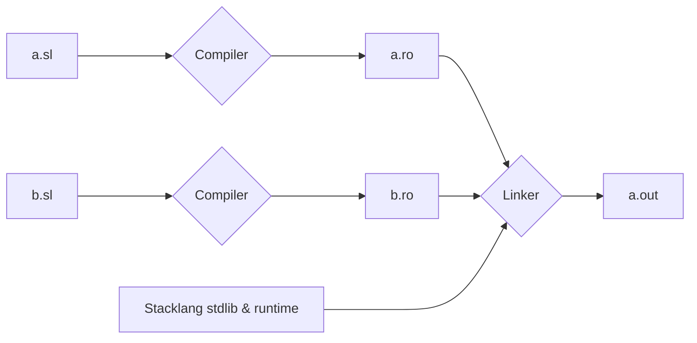
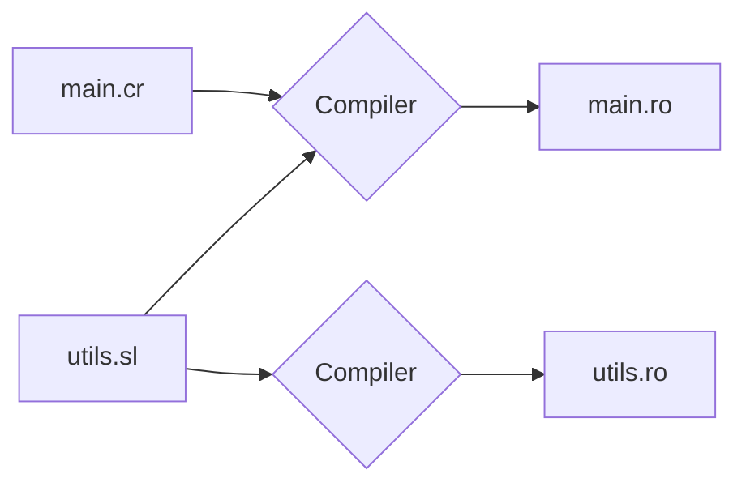

# Stacklang specifications

## Defining Functions

## Defining Globals

## Defining Structures

## Referencing symbols outside the unit

The stacklang compiler work at the unit level. It compiles a single stacklang source file
and produce a single object file. Similarly to C, thoses files must then be linked together with the stacklang runtime to produce an executbale object or raw binary file:



However, unlike C, stacklang does not requires headers file. It can extract prototypes from required sources:



*main.sl*:
```
require "utils"

fun main {
    utils_init()
    return utils_func(1) + utils_global
}
```

*utils.sl*:
```sl
var util_global 

fun utils_init {
    utils_global = 5
}

fun utils_func(p):_ {
    return p + 10
}
```

### Referencing other symbols 

It is possible to declare external symbols through prototypes:

```
var extern util_global 
fun extern utils_init
fun extern utils_func(p):_

fun main {
    utils_init()
    return utils_func(1) + utils_global
}
```

However, this is not like C headers, and a symbol cannot be declared twice, even with the same prototype and no conflicting implementations.